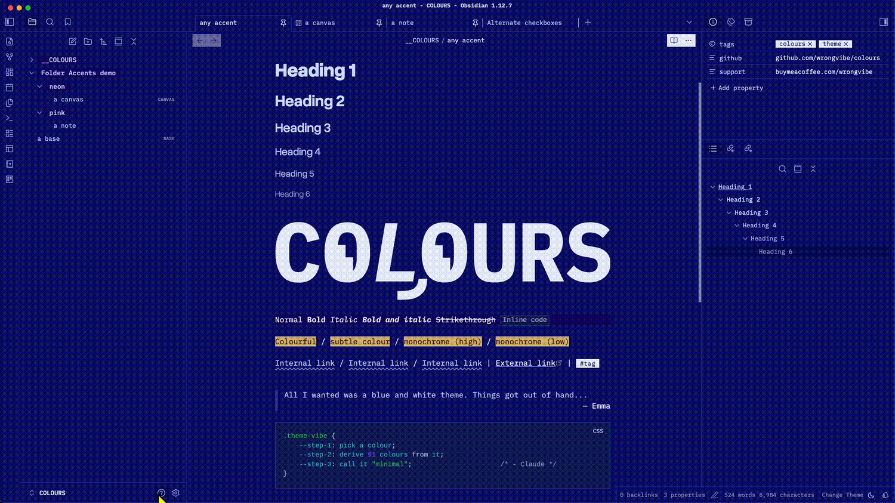
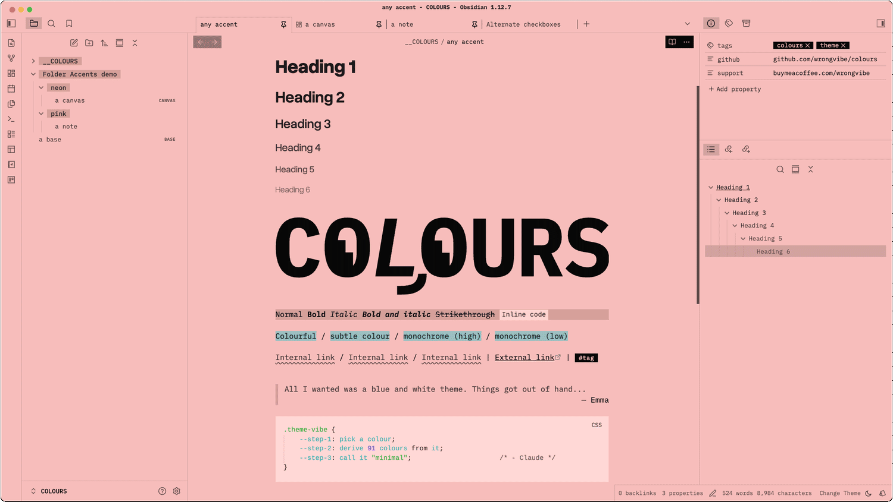
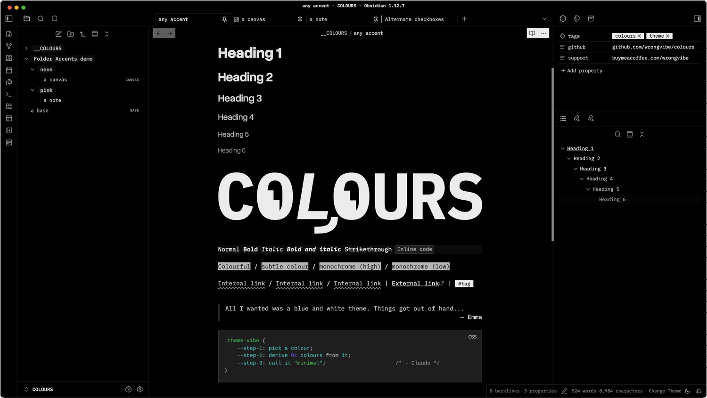
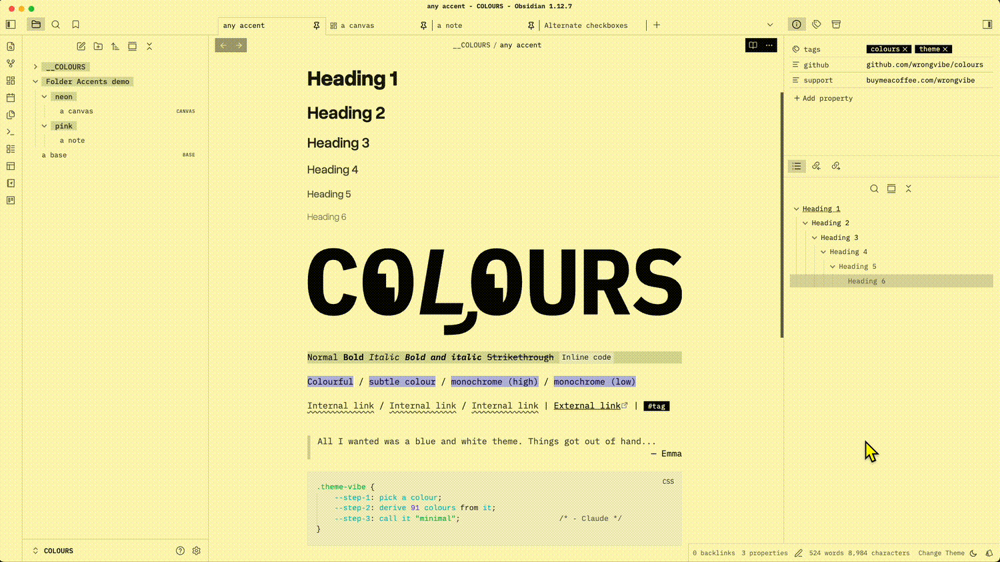
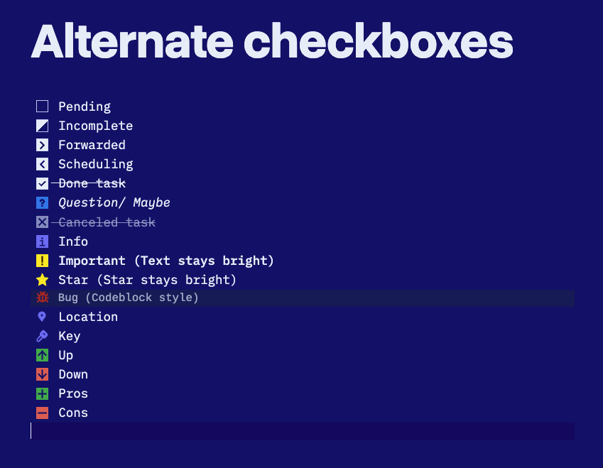
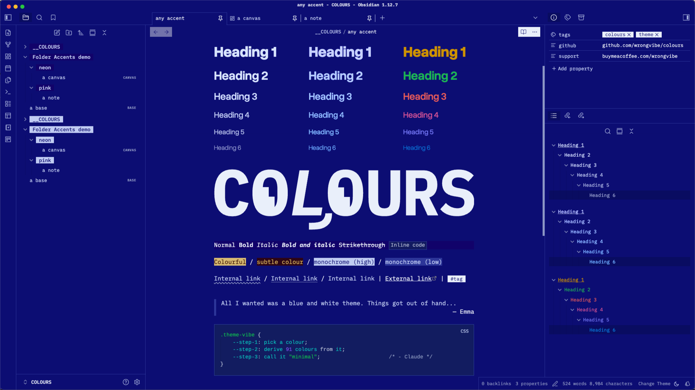
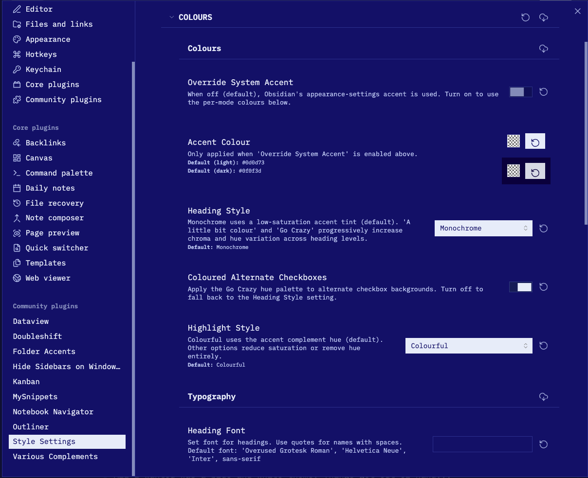

# COLOURS

Accent colour is the theme colour, a minimal Obsidian theme. 

The entire colour palette is derived mathematically from single chosen accent colour. No longer restricted by theme's Light and Dark preset. More options in [Style Settings](#style-settings).

   <table border="0">
    <tr>
      <td></td>
      <td></td>
      <td></td>
    </tr>
  </table>

A companion plugin **[Folder Accents](https://github.com/wrongvibe/folder-accents)** is available for changing accent colour when openning note in designated folder.

   <table border="0">
    <tr>
      <td></td>
      <td></td>
    </tr>
  </table>

## Features

- **Single-accent palette** — Every colour derived from `--color-accent` via `oklch()`; change one colour, everything updates
- **Auto contrast** — Text automatically flips light/dark based on your accent's lightness
- **Auto Dark mode** — Dim palette from your chosen accent colour; Option to save preferred colour in Style Setting without this dim intervention.

- **[Style Settings](#style-settings)** — Colour, typography,layout options via the Style Settings plugin
- **Alternates task checkboxes** — extra styled checkboxes for `important`, `star`, `bug`, `key`, `location` etc

## Requirements

Obsidian **1.5.0+** (required for `oklch(from …)` relative colour syntax — ships with a modern Chromium base).

## Installation

### Community Themes (when published)

1. **Settings → Appearance → Themes → Browse**
2. Search **COLOURS** → Install

### Manual

1. Download `theme.css` and `manifest.json`
2. Place both in `.obsidian/themes/COLOURS/` inside your vault
3. **Settings → Appearance → Themes** → select **COLOURS**

### Fonts
The theme respects Obsidian's font settings, which will override theme setting.

Title and Heading font can be customized via Style Settings → Typography → Heading Font.

| Area | Recommanded fonts |
|------|-------------------|
| Interface font | [IBM Plex Mono](https://fonts.google.com/specimen/IBM+Plex+Mono) |
| Text font | IBM Plex Mono |
| Monospace font | IBM Plex Mono |
| Title and Heading | [Overused Grotesk](https://github.com/RandomMaerks/Overused-Grotesk) |

You will need to install the fonts, they are not included in the theme.

## Style Settings

Install [**Style Settings**](https://github.com/mgmeyers/obsidian-style-settings) community plugin to access these options:

### Colours

#### Override System Accent
When off (default), Obsidian's built-in accent colour picker drives the theme.
Turn **on** to use the per-mode colours below instead of the system accent.

#### Accent Colour
*(Only active when [Override System Accent](#override-system-accent) is on.)*

Set separate accent colours for light and dark mode. Defaults: `#0d0d73` (light) / `#0f0f3d` (dark).

#### Heading Style
How `# H1` through `###### H6` are coloured:

| Option | Description |
|--------|-------------|
| **Monochrome** *(default)* | Low-saturation accent tint — nearly grayscale |
| **A little bit colour** | Slightly more chroma |
| **Go Crazy** | Full chroma, different hue per heading level |

#### Coloured Alternate Checkboxes
*(Default: on)*
Applies the Go Crazy hue palette to alternate checkbox backgrounds. Turn off to fall back to the Heading Style setting.

#### Highlight Style
How `==highlighted text==` appears:

| Option | Description |
|--------|-------------|
| **Colourful** *(default)* | Complementary hue, full saturation |
| **Subtle Colour** | Muted complementary tint |
| **Monochrome (High contrast)** | Dark on light (or vice versa) |
| **Monochrome (Low contrast)** | Subtle grey tones |

---

### Typography

#### Heading Font
Set any font for headings using CSS `font-family` syntax.

- **Default:** `'Overused Grotesk Roman', 'Helvetica Neue', 'Inter', sans-serif`
- **Example:** `Georgia, serif` or `'Departure Mono', monospace`

Quote names that contain spaces.

#### Heading Sizes
Scale all heading sizes up or down:

| Option | H1 → H6 range |
|--------|---------------|
| **Default** | 2.5em → 1.1em |
| **Compact** | 1.8em → 1.0em |
| **Large** | 3.0em → 1.15em |

#### Line Height

| Option | Value |
|--------|-------|
| **Default** | Obsidian default |
| **Relaxed** | 1.8 |
| **Compact** | 1.4 |

#### Enable Uppercase
Applies `text-transform: uppercase` to the note title, table headers, and UI buttons (modals, settings, ribbon, view actions). Off by default.

#### Font Brightness
Scales text opacity. Lower values give a softer, more muted look. Range: 0–1, default: 1.

---

### Layout

#### Table Style

| Option | Description |
|--------|-------------|
| **Tinted header row** *(default)* | Header row tinted with accent |
| **Tinted alternate rows** | Zebra stripe on data rows |

#### Folder Style

| Option | Description |
|--------|-------------|
| **Light Background** *(default)* | Subtle accent tint behind folder names |
| **Inverted Background** | High-contrast muted background with primary text colour |
| **Plain** | No background — unstyled folder names |

#### Internal Link Decoration

| Option | Description |
|--------|-------------|
| **Wavy** *(default)* | Wavy underline on internal links |
| **Underline** | Solid underline |
| **None** | No decoration |

#### Auto-hide Scrollbar
Uses the OS overlay scrollbar — appears on hover/scroll, hidden otherwise. Replaces the theme's custom thin scrollbar.

#### Disable Cursor Line Highlight
Removes the background tint on the active editor line.

#### Hide Inline Title in Canvas
Shows the inline note title in the editor but hides it inside Canvas cards.

#### Readable Line Width
Custom line width when Readable line length is on. Range: 400–1400px, default: 700px.

#### Base Embed Width Multiplier
Controls how wide embedded Bases (`![[Base.base]]`) are relative to the readable line width.
- **Range:** 1× (same as line width) → 5× wider
- **Default:** 1×

Only has a visible effect when readable line length is enabled.

---

## Contributing

Pure CSS — no build step. Edit `theme.css` directly.

## License

GPL-3.0
